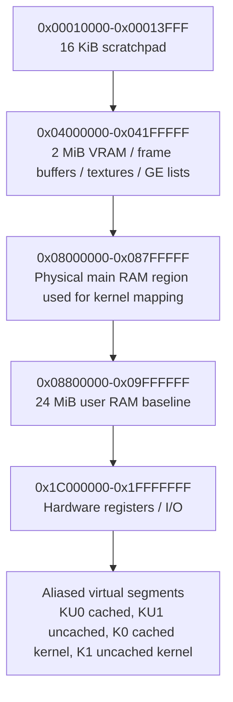
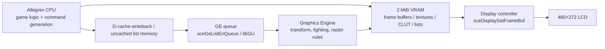

# Designing a comprehensive development document for the

## Executive summary

A solid PSP development document should treat the platform as three things at once: a fixed-function handheld game console with a tightly bounded memory and bandwidth budget; a modular firmware environment whose public APIs are exposed today chiefly through community-maintained SDKs; and a historically split ecosystem in which the original licensed development stack was proprietary, while modern hobbyist and preservation work centres on urlPSPDEVturn5search1, urlPSPSDKturn15search0, urlPPSSPP documentationturn22search5, and the urlPSP Developer Wikiturn13search3. Publicly accessible primary material from urlPlayStationturn17search3 remains strongest for user-visible behaviour, storage/media handling, networking modes, and system software/update behaviour, while lower-level CPU, GPU, memory-map and loader details are mostly preserved in reputable community reverse-engineering resources such as the urluPSPD archiveturn16search2 and urlThe Naked PSPturn16search12. citeturn5search1turn15search0turn17search3turn13search3turn16search2turn16search12turn24search1

The public evidence supports a baseline architectural picture like this: the PSP uses a custom Allegrex MIPS32 main CPU with FPU and VFPU, a separate Media Engine core for media workloads, 2 MiB of VRAM/eDRAM for the Graphics Engine, a 16 KiB scratchpad, and a baseline 32 MiB main-memory model split in public community documentation into kernel and user partitions. Later hardware revisions increased main RAM to 64 MiB, but broad compatibility practice still starts from the original 32 MiB assumptions unless you intentionally target later devices. The Graphics Engine is a fixed-function, display-list-driven renderer rather than a programmable-shader GPU in the modern sense. Native development therefore revolves around batching state changes, careful placement of frame buffers and textures, deliberate cache maintenance before GE or DMA consumption, small working sets, and aggressive avoidance of unnecessary copies. citeturn12search1turn28search0turn29view0turn11search0turn25search6turn27search1turn27search2

For a modern public workflow, the most defensible recommendation is: build with PSPDEV/PSPSDK using CMake or Make; produce both ELF/PRX artefacts for debugging and `EBOOT.PBP` for deployment; iterate first in PPSSPP because its debugger now steps CPU code and GPU draw calls, then validate on real hardware with PSPLINK over USB; design to the 32 MiB baseline, 480×272 display, one analogue nub, and ad hoc / infrastructure Wi‑Fi model; and document clearly which claims come from official PlayStation sources and which come from community reverse engineering. Where public sources do not specify a detail, the document should say so explicitly rather than smoothing over the gap. citeturn12search4turn22search0turn22search5turn22search13turn15search1turn8search0turn24search6

## Platform baseline

The PSP family is not one perfectly uniform target. The original platform baseline is the PSP-1000: 32 MiB of main RAM, 2 MiB of VRAM/eDRAM for graphics, one analogue stick, a 480×272 display, support for entity["product","Universal Media Disc","optical disc format for PSP"], and removable entity["product","Memory Stick Duo","Sony removable flash media"] / entity["product","Memory Stick PRO Duo","Sony removable flash media"] storage. Later revisions added extra RAM, and the PSPgo added internal flash storage and Bluetooth features exposed in the official user guide. Official PlayStation history pages state that UMD can hold up to 1.8 GB, and official PSPgo launch material states that PSPgo includes 16 GB of flash memory. citeturn29view1turn19search1turn21search1turn21search6turn21search0

A development document should therefore define two support tiers up front. The first is the **broad-compatibility tier**, assuming the PSP-1000 baseline and no reliance on internal system storage or Bluetooth-only features. The second is the **late-hardware tier**, where extra RAM and PSPgo-specific capabilities may be used intentionally. Official user-guide material distinguishes clearly between Memory Stick based storage on PSP-1000/2000/3000/E1000 systems and system storage on PSP-N1000, which is a useful way to separate those tiers in documentation. citeturn24search1turn21search0turn21search6turn21search8

### Hardware blocks that matter most to game and application developers

| Subsystem | Publicly supportable baseline | Why it matters in a dev document | Evidence |
|---|---|---|---|
| CPU | Allegrex custom MIPS32 main core with FPU and VFPU; variable clocking exposed via power APIs | Governs code generation, cache behaviour, VFPU usage, and thread attributes | citeturn12search1turn28search0turn25search2 |
| Media Engine | Separate MIPS-based media core used primarily for media decoding paths | Explains why some codec and media capabilities are present without being directly exposed as ordinary gameplay CPU time | citeturn27search2turn29view1 |
| Graphics | Display-list-driven GE with 2 MiB VRAM, fixed-function state, texture compression, skinning/morphing | Central to rendering architecture and optimisation | citeturn30view1turn25search6turn27search1 |
| Main memory | 32 MiB public baseline on PSP-1000; later models add RAM | Determines compatibility budget and content strategy | citeturn29view1turn11search0turn10search1 |
| Display | 480×272 LCD | Fixes render resolution and UI budgeting | citeturn29view1 |
| Storage | UMD plus Memory Stick; PSPgo adds internal system storage | Affects paths, loading patterns, save handling, and deployment | citeturn19search1turn9search2turn9search0turn21search6 |
| Networking | Ad hoc direct PSP-to-PSP, infrastructure via wireless LAN access point; PSPgo adds Bluetooth modem/peripheral support in the user guide | Affects multiplayer architecture and online features | citeturn15search1turn8search0turn8search11 |
| Input | Face buttons, D-pad, shoulder buttons, Start/Select/Home and analogue nub; SDK exposes button/analogue reads | Sets control abstraction and polling/event design | citeturn29view1turn15search2 |

### CPU, caches, memory map, interrupts and DMA

Public reverse-engineering sources concur that Allegrex is a little-endian custom MIPS32-class core with a single-precision FPU, a VFPU, a 16 KiB scratchpad on the main CPU, and split L1 caches that are most commonly described as 16 KiB instruction plus 16 KiB data cache per core. Community documentation variously describes the lineage as “MIPS32 4K-class” or “R4000-family” style, but the exact heritage is not specified in publicly accessible PlayStation material; a careful document should therefore present the lineage as community-described rather than officially confirmed. The CPU defaults practically to 222 MHz in many software contexts and can be driven up to 333 MHz through power-management APIs such as `scePowerSetClockFrequency`, `scePowerSetCpuClockFrequency`, and `scePowerSetBusClockFrequency`. citeturn12search1turn28search0turn28search2turn25search2

The public 32 MiB baseline memory map most developers use is: 16 KiB scratchpad at `0x00010000`, 2 MiB VRAM at `0x04000000`, 8 MiB kernel RAM mapped in K0 space from `0x88000000`, and 24 MiB user RAM from `0x08800000`. The user-visible code start commonly appears around `0x08900000` in community documentation. Cached and uncached aliases matter: the PSP exposes both cached and uncached segments, and GE display lists and DMA-fed data frequently need uncached addresses or an explicit data-cache writeback before hardware consumption. citeturn29view0turn11search0turn12search2turn28search0

The following Mermaid diagram is a good public-facing baseline map for documentation. It reflects the commonly cited 32 MiB model; if you also document 64 MiB late-model targets, present them as an extension rather than silently replacing the baseline. citeturn29view0turn11search0turn10search1



Interrupt management is directly exposed through PSPSDK APIs such as `sceKernelCpuSuspendIntr`, `sceKernelCpuResumeIntr`, `sceKernelRegisterSubIntrHandler`, `sceKernelEnableSubIntr`, and `sceKernelDisableSubIntr`. Public headers enumerate interrupt lines that matter to developers, including display/VBlank, GE, UMD, ATA, WLAN, audio, DMA and DMACPLUS. Documentation should therefore distinguish **ordinary user-mode code**, which typically consumes high-level APIs, from **kernel-mode or low-level homebrew work**, which may register sub-interrupt handlers directly. citeturn27search3turn27search0

DMA should be covered in two layers. At the SDK layer, PSPSDK exposes `sceDmacMemcpy()` and `sceDmacTryMemcpy()`. At the rendering layer, display lists are themselves fed to the GE through a DMA-style path, which is why stale cache lines on list memory are such a common source of rendering bugs. A good document should show both forms explicitly, because they affect optimisation and correctness, not just speed. citeturn27search1turn28search0turn30view1

Power management is not just a battery topic; it is a performance-control topic. The public SDK exposes battery queries, online-power status, idle timer control, suspend/standby requests, power callbacks and CPU/bus clock controls. Official user-guide material also documents WLAN power saving and ordinary suspend/update constraints. A practical document should therefore tie power APIs to profiling policy: start at conservative clocks, measure, then raise frequency only for proven bottlenecks. citeturn25search2turn25search4turn15search11

## Graphics, audio, video and I/O

The PSP Graphics Engine should be documented as a **fixed-function, display-list-based renderer**. Community technical sources describe it as “modelled on a simplistic GL-like API”, with 2 MiB VRAM, support for pulling textures and lists from main RAM, texture formats including CLUT and DXT/S3TC variants, and features such as skinning, morphing, splines/Bezier surfaces, stencil buffers, alpha blending and logical operations. PSPSDK’s `libgu` and `libgum` map directly onto this design: GU exposes fixed-function state and draw calls, while GUM provides matrix manipulation. This is the strongest public basis for saying that the PSP does **not** expose programmable vertex or pixel shaders in the way later GPUs do; the public programming model is stateful and fixed-function, not shader-program driven. citeturn30view1turn25search6turn27search1turn29view0

A development document should separate the graphics stack into three public API layers:

| Layer | Purpose | Typical use | Evidence |
|---|---|---|---|
| `sceDisplay*` | Display mode, frame-buffer selection, VBlank waits | 2D frame-buffer work, swaps, timing | citeturn27search1 |
| `sceGe*` | Queue, sync and control GE display lists | Low-level rendering control and debugging | citeturn27search1 |
| `libgu` / `libgum` | Fixed-function rendering and matrix helpers | Most native 2D/3D homebrew and sample code | citeturn13search2turn25search6 |

A useful rendering-pipeline diagram for the document is:



Public PlayStation manual material documents user-visible media playback capabilities clearly enough to anchor a codecs section. For video, the user guide lists Memory Stick Video / MP4 with MPEG‑4 Simple Profile (AAC), H.264 / MPEG‑4 AVC Main Profile and Baseline Profile (AAC), and AVI Motion JPEG with Linear PCM or μ‑Law. For music, the guide documents MP3, MP4/AAC-LC and WMA in the SensMe path, while other official material and firmware-history notes show ATRAC3 / ATRAC3plus support in the wider music stack. If you write an API section for codecs, mark it as partially community-derived unless you have licensed SDK material: public official sources are much stronger on *what the system plays* than on *how the underlying media modules are intended to be programmed*. citeturn17search0turn17search1turn9search12turn14search16

Input and networking should be documented as baseline platform contracts, not afterthoughts. PSPSDK’s controller headers expose digital button masks and analogue X/Y reads (`Lx`, `Ly`), and official PlayStation user-guide material distinguishes ad hoc mode from infrastructure mode. Ad hoc is direct PSP-to-PSP communication; infrastructure uses a wireless LAN access point. Official user-guide material also notes that enabling UMD cache can interfere with ad hoc communication in some cases, which is exactly the kind of cross-subsystem detail a serious platform document should preserve. citeturn15search2turn15search1turn8search0turn15search3

## System software and runtime model

Public community sources describe the PSP operating environment as a **modular kernel** rather than a process-centric desktop OS. User applications are themselves modules, modules can import and export functions, and kernel reset / load-exec behaviour is an important part of lifecycle management. Official PlayStation material confirms the existence of system-software updates via Internet or storage media and shows that updates can be delivered from UMD, Memory Stick or system storage. A rigorous document should therefore explain two distinct layers: the **official user-facing system software model** exposed in the user guide, and the **module/kernel execution model** documented mostly by PSPSDK and community research. citeturn24search1turn24search6turn16search12turn16search4turn13search2

The best public description of executable formats is:

- **ELF** is the base executable and link format used in the toolchain.  
- **PRX** is a relocatable PSP executable/module format derived from ELF and used heavily for firmware modules and for homebrew workflows such as PSPLINK.  
- **EBOOT.PBP** is the boot package/archive used by the shell/XMB to launch content, containing metadata and payloads such as `PARAM.SFO`, optional media assets and executable/data content. Public format references describe PBP as an uncompressed archive with indexed offsets. citeturn13search2turn11search4turn14search0turn16search4

Threading and synchronisation deserve substantial space. PSPSDK exposes `sceKernelCreateThread`, `sceKernelStartThread`, `sceKernelChangeThreadPriority`, `sceKernelGetThreadStackFreeSize`, and a wide set of threadman primitives: semaphores, event flags, lightweight mutexes, message boxes, message pipes, fixed and variable pools, alarms, virtual timers and callbacks. Public homebrew-era documentation also notes that VFPU use requires a thread attribute enabling VFPU access. A serious platform document should not reduce the PSP to “single-threaded game loop plus VBlank”; the kernel surface is materially richer than that. citeturn15search4turn26search2turn28search1

### Standard file paths and mount conventions

Official PlayStation sources document many **content folders** but not every mount-string developers use in homebrew contexts. Community sources document those mount names. The cleanest way to present this is to distinguish **officially documented content paths** from **community-documented mount prefixes**. citeturn9search3turn9search7turn9search9turn12search4turn14search9turn18search0

| Path / convention | Role | Public status | Evidence |
|---|---|---|---|
| `ms0:/PSP/GAME/<APP>/EBOOT.PBP` | Standard Memory Stick homebrew/game launch location for EBOOT deployment | Publicly documented in PSPDEV examples | citeturn12search4 |
| `ms0:/MUSIC` | Music import folder | Official user guide | citeturn9search9 |
| `ms0:/VIDEO` | Video import folder | Official user guide | citeturn9search3 |
| `ms0:/PICTURE` | Image import folder | Official user guide | citeturn9search7 |
| `ms0:/PSP/PHOTO` | Alternate recognised image path under `PSP` | Official user guide | citeturn9search7 |
| `umd0:/` | Community-documented UMD root / current working directory root in UMD-emulation contexts | Community documentation | citeturn14search9 |
| `disc0:/PSP_GAME/SYSDIR/...` | Conventional UMD game layout used by commercial software and emulator tooling | Community documentation | citeturn12search3 |
| `flash0:/...` | Internal firmware files and modules; not a normal application target | Community documentation, not end-user official guide | citeturn18search0 |
| `system storage` on PSPgo | Official logical storage location; official guide does not expose a mount-string in public end-user docs | Official user guide uses logical term, not path string | citeturn21search6turn21search0 |

When documenting `EBOOT.PBP`, it is worth stating that `PARAM.SFO` is the metadata authority for title text and boot-related flags visible to the shell, while PBP packaging can also carry icon/background/preview assets. When documenting `PRX`, explain imports/exports and relocatability explicitly; if you omit that, your readers will miss why PSPLINK, module builds, and patching/loader topics keep returning to PRX rather than flat ELF. citeturn14search1turn14search0turn16search4

## Public development stacks, debugging and emulation

The original licensed PSP SDK clearly existed and was distributed through official developer channels, including historical educational programmes such as PlayStation-edu, but detailed manuals for that stack are not publicly accessible on the modern web. Public work today therefore depends overwhelmingly on PSPDEV/PSPSDK and its surrounding tools. A comprehensive document should say that plainly, because failing to distinguish **licensed historical practice** from **publicly reproducible current practice** is one of the biggest sources of confusion in PSP technical writing. citeturn6search1turn5search1turn13search2

### SDK and toolchain comparison

| Stack | Status | Strengths | Weaknesses / cautions | Evidence |
|---|---|---|---|---|
| Historical licensed PSP SDK | Official but not publicly distributed today | Native first-party toolchain and docs for licensed development | Public access is restricted; detailed documentation is unspecified in openly accessible sources | citeturn6search1 |
| PSPDEV + PSPSDK | Current public default | Active open-source SDK; libraries for OS, display, networking, GU/GUM, audio; tools for PBP/SFO/PRX; supports official and custom firmware workflows | Community-maintained, not affiliated with Sony; some low-level behaviour remains reverse-engineered | citeturn5search1turn13search2turn22search3 |
| PSPDEV from source / prebuilt release archives | Same stack, different install modes | Reproducible toolchain; CMake wrappers; package support | Requires host setup and cross-compile environment discipline | citeturn5search0turn13search5turn26search12 |
| Legacy minPSP | Historical community alternative | Lightweight and historically influential | Legacy / lower-confidence choice for new work | citeturn25search8turn26search7 |

For current public development, PSPDEV’s own documentation is unambiguous: install the SDK, compile with either CMake (`psp-cmake`) or Make, use PSPSDK libraries, and generate `EBOOT.PBP` as part of the build. The strongest default recommendation is therefore **PSPDEV + CMake for new projects**, with Make retained mainly for maintaining older samples or ports. citeturn12search4turn5search0turn5search5

### Debugging, profiling and emulators

| Tool / target | Best use | What it gives you | Caveat | Evidence |
|---|---|---|---|---|
| Real PSP + PSPLINK | Final correctness, USB-hosted rapid iteration | Run/debug over USB without repeatedly copying builds; works with unencrypted PRX; integrates with `pspsh` and GDB workflows | Requires hardware and setup; build output often needs PRX form for interactive loading | citeturn22search0turn22search1 |
| urlPPSSPPturn22search5 | Primary emulator for active development | Built-in cross-platform debugger, GE draw-call stepping, remote debugger and logging tools | Emulator behaviour is excellent but not a substitute for final hardware validation | citeturn22search5turn22search13turn22search15 |
| urlJPCSPturn23search0 | Secondary compatibility cross-check, historical emulator reference | Java-based emulator with its own debug tools and long preservation history | Less clearly the “mainline” dev target than PPSSPP for active workflows | citeturn23search0turn23search1turn23search3 |

Profiling is one area where public PSP docs are better than many developers realise. Community hardware docs note on-board profiling hardware for cache hits and executed instructions, and PSPSDK exposes `sceKernelReferThreadProfiler()` and `sceKernelReferGlobalProfiler()`. That does not eliminate the need for ordinary frame-time instrumentation, but it means a rigorous document should include both **high-level game telemetry** and **kernel/profile-register-level diagnosis** in its debugging chapter. citeturn28search0turn28search1

### Homebrew considerations

The official PlayStation system-software licence explicitly forbids unauthorised or modified hardware/software, reverse engineering, circumvention of security/authentication mechanisms, and use of system software to develop unauthorised PSP software or hardware. At the same time, PSPDEV states that its open-source SDK can produce software for both custom and official firmware contexts, and includes tools such as `ebootsigner` for official-firmware-compatible homebrew flows. In a public development document, the right stance is therefore: document lawful homebrew packaging, testing and deployment at a high level, but avoid exploit or circumvention guidance; separate **legal restrictions in official policy** from **technical capabilities in the community toolchain**; and label any firmware-signing or CFW-dependent path explicitly as outside official PlayStation support. citeturn24search6turn22search3turn5search1

## Recommended workflow, sample layout and build scripts

The most dependable public workflow is:

1. Install PSPDEV on Linux, macOS or WSL.  
2. Start with PSPSDK examples and a CMake project.  
3. Build both debug-friendly artefacts and deployable `EBOOT.PBP`.  
4. Test first in PPSSPP for fast edit-run-debug cycles.  
5. Validate on real hardware through PSPLINK.  
6. Optimise only after proving correctness and measuring where the frame time or load time is actually going. citeturn5search0turn5search5turn12search4turn22search0turn22search5

A good sample project layout for documentation is:

```text
my-psp-project/
├── CMakeLists.txt
├── assets/
│   ├── textures/
│   ├── audio/
│   └── fonts/
├── include/
│   ├── app.h
│   ├── renderer.h
│   └── platform.h
├── src/
│   ├── main.c
│   ├── app.c
│   ├── renderer_gu.c
│   ├── input.c
│   ├── audio.c
│   └── filesystem.c
├── shaders/
│   └── README.md        # note: fixed-function pipeline, no native shaders
├── tools/
│   ├── pack_assets.py
│   └── run_psplink.sh
├── third_party/
│   └── stb/
└── build/
```

That layout is not prescribed by PSPDEV, but it matches the public toolchain cleanly: one cross-compile project root, separate assets, explicit renderer split, and tooling scripts beside the build rather than hidden in IDE state. It is a pragmatic synthesis of the PSPDEV CMake examples and the realities of hardware/emulator iteration. citeturn12search4turn22search0

A minimal `CMakeLists.txt` for a native PSPSDK project can be written like this:

```cmake
cmake_minimum_required(VERSION 3.11)
project(sample_psp C)

add_executable(${PROJECT_NAME}
    src/main.c
    src/app.c
    src/renderer_gu.c
    src/input.c
)

target_include_directories(${PROJECT_NAME} PRIVATE include)

target_link_libraries(${PROJECT_NAME} PRIVATE
    pspdebug
    pspdisplay
    pspge
    pspgu
    pspgum
    pspctrl
)

create_pbp_file(
    TARGET ${PROJECT_NAME}
    ICON_PATH NULL
    BACKGROUND_PATH NULL
    PREVIEW_PATH NULL
    TITLE "Sample PSP App"
    VERSION 01.00
)
```

This is directly aligned with PSPDEV’s published CMake model: compile an executable, link PSPSDK libraries, and create a PBP as a build output. citeturn12search4

A compact shell build-and-run script for emulator use is:

```bash
#!/usr/bin/env bash
set -euo pipefail

mkdir -p build
cd build
psp-cmake ..
make -j"$(nproc)"

# Result: build/EBOOT.PBP
# Copy into the emulator memstick layout expected by your test setup.
mkdir -p ./memstick/PSP/GAME/SAMPLE
cp EBOOT.PBP ./memstick/PSP/GAME/SAMPLE/EBOOT.PBP
```

And a PSPLINK-oriented loop should build a PRX as well as the normal ELF/PBP outputs, because PSPDEV’s debugging guide states that PSPLINK expects an unencrypted `.prx` for remote loading and debugging. citeturn22search0

A simple runtime skeleton that demonstrates module metadata, input polling and VBlank pacing can look like this:

```c
#include <pspkernel.h>
#include <pspdebug.h>
#include <pspctrl.h>
#include <pspdisplay.h>

PSP_MODULE_INFO("SampleInput", 0, 1, 0);
PSP_MAIN_THREAD_ATTR(PSP_THREAD_ATTR_USER);

int main(void) {
    pspDebugScreenInit();
    sceCtrlSetSamplingCycle(0);
    sceCtrlSetSamplingMode(PSP_CTRL_MODE_ANALOG);

    while (1) {
        SceCtrlData pad;
        sceCtrlReadBufferPositive(&pad, 1);

        pspDebugScreenSetXY(0, 0);
        pspDebugScreenPrintf("Buttons: 0x%08X\n", pad.Buttons);
        pspDebugScreenPrintf("Analog : %3u, %3u\n", pad.Lx, pad.Ly);

        if (pad.Buttons & PSP_CTRL_START) {
            sceKernelExitGame();
        }

        sceDisplayWaitVblankStart();
    }

    return 0;
}
```

The code is intentionally conservative: user thread, direct controller polling, one VBlank-synchronised loop, and clean exit. That is the right baseline example in a platform document because it shows the public SDK surface without yet committing to any particular engine architecture. citeturn15search2turn12search4turn5search4

## Optimisation guidance

PSP optimisation has to be documented as a **budgeting problem**, not just an instruction-count problem. The key scarce resources are user RAM, VRAM, bus bandwidth, UMD / removable-storage latency, cache locality, and GE command bandwidth. You will mislead readers if you present “CPU speed” as the dominant constraint by itself. citeturn29view0turn30view1turn28search2

For the CPU, the strongest public recommendations are these. Keep hot data cache-friendly; use VFPU deliberately for maths-heavy work, but only on threads created with VFPU access enabled; prefer fixed-point or reduced-precision paths where content allows; and profile before clocking up. Because the PSP exposes explicit cache-maintenance functions, low-level code generation, DMA handoff, and self-modifying or dynamically generated code all need cache discipline, not just “fast code”. The SDK functions `sceKernelDcacheWritebackInvalidateAll`, `sceKernelDcacheWritebackRange`, and `sceKernelIcacheInvalidateRange` are not optional trivia; they are part of correctness for some advanced paths. citeturn12search2turn15search4turn28search0

For the GPU, batch more and chat less. Build larger display lists, minimise state changes, keep frame buffers resident in VRAM, and remember that textures and lists can be sourced from main RAM so long as cache coherency is handled properly. PSPDEV’s own examples remind developers that power-of-two texture dimensions matter for native GU examples, while community GE documentation shows DXT formats, CLUT paths, skinning and morphing support that can trade computation against bandwidth depending on content shape. Because the GE is fixed-function, good performance usually comes from **content formatting and command ordering**, not from clever shader work that the machine cannot do. citeturn25search7turn30view1turn29view0turn25search6

For memory and bandwidth, design first to the 24 MiB user-space budget of the 32 MiB baseline map. Stream large assets; aggressively compress textures where artefact tolerance allows; avoid duplicate decoded copies of the same asset; use double-buffering and ring buffers for transient GPU work; and treat UMD and removable-media access as latency-sensitive operations rather than transparent files. Official PlayStation user material already shows how much of the platform assumed explicit storage media distinctions, and community technical docs remind us that the GE can read lists/textures from main RAM precisely because VRAM is too small to hold everything at once. citeturn29view0turn9search2turn9search0turn30view1

For threads and synchronisation, optimise for *fewer* interacting moving parts. The PSP thread manager is powerful, but every extra thread brings stack cost, wakeups, synchronisation and cache churn. A good document should recommend one main loop, a dedicated streaming or audio helper only where justified, and explicit use of semaphores / event flags / message pipes rather than ad hoc spin loops. If you do use the volatile-memory APIs, label them as advanced and model-sensitive in the document; public homebrew documentation describes a special volatile partition and lock/unlock calls, but it is not a general substitute for disciplined memory design. citeturn26search2turn28search1turn16search12

For debugging and performance validation, the practical order of operations should be written down very explicitly:

1. Reproduce first in PPSSPP with logs and debugger.  
2. Confirm on hardware with PSPLINK if the bug touches timing, media, WLAN, or cache-sensitive rendering.  
3. Use frame-time counters and coarse subsystem timers before deeper profiling.  
4. Reach for global/thread profiler registers only when the simpler measurements identify a hot path but not its micro-behaviour. citeturn22search5turn22search13turn22search0turn28search1

## Open questions and limitations

Some details a perfect PSP document would ideally include remain **unspecified in public official sources** and are known mainly through community reverse engineering. That includes the exact official licensed-SDK API surface for some subsystems, the most authoritative public statement of Allegrex’s microarchitectural lineage, the full late-model 64 MiB memory layout from Sony’s own documentation, and detailed programming guidance for internal media blocks such as the VME and AVC engines. The public sources used here are strong enough for a rigorous developer-facing document, but those parts should be labelled as community-derived rather than first-party confirmed. citeturn6search1turn12search1turn11search0turn27search2turn16search17

A second limitation is legal rather than technical. The official PlayStation system-software licence is plainly hostile to unauthorised development and circumvention, so any public document should keep **licensed development history**, **lawful hobbyist homebrew packaging**, and **security-bypass discussion** in separate lanes. For a modern public report, the safe and accurate boundary is to cover architecture, SDKs, packaging, debugging, optimisation and testing, while leaving exploit and circumvention procedures outside scope. citeturn24search6turn5search1