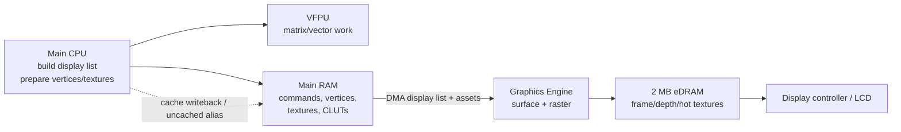

# PSP Rendering Techniques and Engine Optimisation on Sony PSP

## Executive summary

The PSP is best understood as a **display-list-driven, fixed-function graphics system wrapped around a very small fast local memory**. Its Graphics Engine lives on a diet of command lists built by the CPU, DMA-fed from main RAM, and rendered into only **2 MB of eDRAM**. The main CPU has ordinary scalar execution, a scalar FPU, and a separate **VFPU** programming model; the GE also has its own fixed-function vector/surface stage. What it does **not** expose publicly is a PS2-style programmable VU/microcode workflow or any modern programmable shader model. In practice, that means PSP performance is dominated less by “shader ALU” and more by **eDRAM budgeting, host-memory bandwidth, cache coherency, vertex/texture format choice, and command-stream overlap**. citeturn22view0turn22view2turn22view3turn14view0turn16view4turn51view0

If you want the fastest practical PSP renderer, the priorities are consistent across the official SDK materials, PSPSDK docs, and the strongest public samples: use **small vertex formats** wherever possible, prefer **GU_TRANSFORM_2D** for HUD and sprite work, keep hot render targets and hot textures in eDRAM only when they clearly beat the framebuffer trade-off, use **swizzled** and often **indexed/CLUT** textures, batch by material/state into longer display lists, avoid needless full-pipeline synchronisation, and treat cache management as a correctness requirement rather than a late optimisation. Sony’s own SDK mirror even lists lightweight content libraries—**libgiq_picture** and **libgmq_model**—whose stated purpose is to do the same job as the heavier variants with **less CPU load**. citeturn4search0turn46view3turn48view0turn28view1turn29view1turn8view0

For a portability baseline, it is safest to design against the **PSP-1000 class floor**: 32 MB of main RAM and 2 MB of graphics eDRAM. Later retail models expanded main RAM to **64 MB**, which is extremely useful for streaming, asset caches, and bigger working sets, but it does **not** change the tiny local graphics memory that constrains framebuffers, depth, and render-to-texture. Publicly accessible power-control APIs also expose CPU and bus frequency scaling up to **333 MHz CPU / 167 MHz bus**, and Sony later allowed licensed games to use the full 333 MHz ceiling, but higher clocks do not remove the core memory-layout and coherency bottlenecks. citeturn20search0turn20search2turn14view0turn42view2turn18search3turn41view0turn30news3

The strongest public evidence for shipping PSP engines points to a common pattern: **forward, fixed-function renderers with aggressive content reduction and platform-specific data packing**, not general-purpose shader-heavy pipelines. Public evidence exists for **custom engines** and for middleware such as **RenderWare**, **Gamebryo**, **PhyreEngine**, and **Scaleform GFx** on PSP; by contrast, I did **not** verify a public primary-source runtime target for Unity or Unreal on PSP in the materials reviewed here, so I treat those as **unverified rather than supported**. citeturn33search1turn33search4turn33search5turn33search0turn30news3turn30search6

## Architecture constraints that actually matter

This report assumes **PSP-1000 memory budgets as the safe baseline** and notes later 64 MB models separately. Public reverse-engineering and developer references agree on the core layout: **16 KB scratchpad**, **2 MB video memory/framebuffer space**, and **32 MB main memory** on the original hardware; later retail models are widely documented as increasing main memory to **64 MB** while keeping the rest of the graphics story largely the same. For a renderer, that immediately implies two separate budgets: a **working-set budget in main RAM** and a **much smaller working-set budget inside GE-local eDRAM**. citeturn14view0turn20search0turn20search2

On the CPU side, the accessible public material exposes a standard cache hierarchy plus a **VFPU** that must be explicitly managed per thread. PSPSDK states that `pspvfpu_initcontext()` “sets the calling thread’s VFPU attribute”, and the thread manager exposes `PSP_THREAD_ATTR_VFPU`; Sony’s mirrored SDK catalogue separately lists **ALLEGREX**, **FPU**, and **VFPU** manuals. That is the clearest public answer to the “ALU/FPU/VU?” question: the PSP has ordinary CPU integer/scalar floating-point execution and a CPU-side **VFPU**, plus a GE-side fixed-function vector stage, but **not** a publicly programmable PS2-style VU pipeline. citeturn51view0turn42view4turn8view0turn22view3

The GE itself is a **fixed-function rasteriser controlled by display lists**. Public descriptions of the pipeline split it into a **surface engine** for vector/surface work and a **rendering engine** for rasterisation and pixel operations. The PSPdev/PSPSDK API surface lines up with that model: matrices are explicit, texture combiner modes are explicit, bone matrices and morph weights are explicit, and command lists are first-class. That programming model strongly rewards content and batching decisions that minimise state churn and duplicate work, because there is no programmable shader stage to hide poor data design. citeturn22view0turn22view3turn42view3turn49view0turn49view1

The PSP’s bus layout is unusually important to engine design. Public hardware analysis describes a **128-bit system bus**, a second **128-bit Media Engine bus**, and a **32-bit peripheral bus**; within the GE there is also a **128-bit local bus** and a direct **512-bit line to eDRAM**. Even without relying on a single contested GB/s figure, the implication is clear: the machine is built to let fixed-function blocks move data without constant CPU intervention, but **contention still exists**, and the worst-case contention shows up when CPU, GE, decompression/streaming, and display all compete for shared RAM or queue ownership. citeturn21search0turn22view1turn22view2

The VME/Media Engine side is relevant, but mostly as an auxiliary partner. Public documentation describes a **2 MB Media Engine internal RAM** and a **VME** block with **reconfigurable DSPs**, a **128-bit bus**, **166 MHz @ 1.2 V**, and roughly **5 giga operations/sec** for media-oriented workloads. That makes ME/VME useful for decode, media, and possibly asynchronous support tasks, but the dominant publicly documented 3D path remains **main CPU + GE**. citeturn14view4turn15view1turn20search2

Power and clocks are exposed more directly than on many handhelds. PSPSDK documents clock APIs for CPU, bus, and PLL; the public header comments give valid ranges of **1–333 MHz CPU**, **1–167 MHz bus**, and **19–333 MHz PLL**, with the constraints `cpufreq <= pllfreq` and `busfreq*2 <= pllfreq`. Historically, Sony initially capped licensed software at **222 MHz**, then later allowed **333 MHz** for new titles; contemporary coverage singled out *God of War: Chains of Olympus* as an early beneficiary. The practical reading is simple: 333 MHz can save a borderline frame, but it does **not** make sloppy memory traffic cheap. citeturn18search3turn41view0turn20search1turn30news3



The diagram above matches the public command-list model: CPU-side preparation in host memory, GE-side DMA consumption, and raster output into eDRAM, with explicit cache hygiene required whenever a non-CPU unit reads freshly written data. citeturn22view0turn22view1turn16view2turn16view3

## Memory layout, formats, and the real cost of every buffer

The most brutal PSP renderer constraint is not the nominal screen resolution of **480×272**, but the fact that the framebuffer stride is conventionally **512 pixels wide**. PSPSDK’s public header defines `GU_SCR_WIDTH` = 480, `GU_SCR_HEIGHT` = 272, and `GU_VRAM_WIDTH` = 512; `guGetStaticVramBuffer()` also documents that the width is usually **512** and must be a power of two. This padding is small in percentage terms but significant when the entire local graphics store is only **2 MB**. citeturn47view2turn46view3turn42view2

| Local-memory layout | Approx. bytes | Approx. KiB | Practical reading |
|---|---:|---:|---|
| One 16-bit framebuffer | 278,528 | 272 | Cheap; leaves room for depth and textures |
| Two 16-bit framebuffers | 557,056 | 544 | Standard double-buffer baseline |
| Three 16-bit framebuffers | 835,584 | 816 | Feasible, but tighter with depth/RTTs |
| One 32-bit framebuffer | 557,056 | 544 | Better colour precision, double the cost |
| Two 32-bit framebuffers | 1,114,112 | 1,088 | Still viable, but texture budget shrinks fast |
| One 16-bit depth buffer | 278,528 | 272 | Typical eDRAM trade-off item |
| Two 16-bit FBs + one 16-bit Z | 835,584 | 816 | Sensible high-performance baseline |
| Two 32-bit FBs + one 16-bit Z | 1,392,640 | 1,360 | Leaves little headroom for hot textures |
| Three 32-bit FBs + one 16-bit Z | 1,949,696 | 1,904 | Technically fits, practically cripples local texture space |

These figures are derived directly from the public PSPSDK macros for visible size and VRAM stride, together with the public GE eDRAM size of **2 MB**. They explain why many efficient PSP renderers prefer **16-bit colour and 16-bit depth** unless 32-bit colour is clearly worth the eDRAM cost. citeturn47view2turn42view2turn28view2

Texture and framebuffer formats are more flexible than a quick reading of the high-level GU docs suggests. The public GU helper documentation lists `5650`, `5551`, `4444`, `8888`, `T4`, and `T8` in key helper calls, but the public `pspgu.h` header also exposes **`T16`, `T32`, `DXT1`, `DXT3`, and `DXT5`** enums. CLUT mode supports palette storage in `5650`, `5551`, `4444`, or `8888`, and CLUT uploads must be **16-byte aligned**. In other words, the machine gives you several distinct bandwidth-reduction levers: **smaller colour formats**, **indexed textures**, and **block-compressed textures**. citeturn46view3turn47view2turn48view0turn48view1

| Format | Bytes per texel or storage class | Alpha capability | Best use on PSP |
|---|---|---|---|
| `GU_PSM_5650` | 2 B/texel | None | Opaque world textures, colour buffers |
| `GU_PSM_5551` | 2 B/texel | 1-bit | Cut-outs, masks, UI with binary alpha |
| `GU_PSM_4444` | 2 B/texel | 4-bit | Effects, particles, HUD, blended sprites |
| `GU_PSM_8888` | 4 B/texel | 8-bit | Only where precision clearly matters |
| `GU_PSM_T4` / `T8` | Indexed | CLUT-based | Huge bandwidth win for UI and stylised art |
| `GU_PSM_T16` / `T32` | Indexed | CLUT-based | Niche, but publicly exposed |
| `GU_PSM_DXT1/3/5` | Block-compressed | Varies by mode | Good where tools and artefacts are acceptable |

The table is a synthesis of the public `pspgu.h` enums plus the CLUT-mode documentation. The optimisation implication is straightforward: on PSP, **format choice is part of renderer design**, not just asset export. citeturn47view2turn48view0

The command path is equally important. Public descriptions of the GE state that the CPU builds **display lists in main memory**, the GE reads them via **DMA**, and the list processing model explicitly supports overlap between CPU list construction and GPU execution. The `sceGeListEnQueue()` API takes a **list head** and an optional **stall address**; higher-level GU entry points (`sceGuStart`, `sceGuFinish`, `sceGuSendList`, `sceGuCallList`) are just more convenient ways to drive that same queue. This makes **double-buffered display-list memory** one of the highest-confidence architectural wins on PSP. citeturn22view0turn42view0turn42view3turn4search0

The most non-negotiable rule is **cache coherency**. Public documentation is explicit that the PSP’s MIPS core has **no hardware snooping/coherency support**. Fresh CPU writes can sit in dirty cache lines while the GE or DMA reads stale RAM. YAPSPD recommends **64-byte cache-line alignment**, using `memalign`-style allocations, and either using the **uncached alias** or explicitly issuing `sceKernelDcacheWriteback*` / `Invalidate*` operations before and after hand-off. It even notes that for ranges larger than roughly **16 KB**, full-cache writeback may be preferable to narrow range operations. If you ignore this, you do not merely lose performance—you get corrupted vertices, partial textures, and intermittent bugs. citeturn16view0turn16view2turn16view3turn16view4

A subtle but useful low-level detail is that GU raw command helpers expose the GE’s compact command payload model: `sceGuSendCommandi()` sends the lower **24 bits** of an integer, while `sceGuSendCommandf()` converts a float into the GE’s **24-bit float** representation. That matters if you build custom command streams or micro-optimised wrappers, because you are talking to a compact command ISA, not a wide modern register interface. citeturn4search0

## Engine patterns in commercial software and in the public source corpus

The cleanest, highest-confidence public corpus for PSP rendering is the combination of **Sony SDK documentation** and **PSPSDK**. Sony’s mirrored SDK index lists not only **GE**, **libgu**, and **libgum**, but also content-facing libraries such as **libgim_picture**, **libgmo_model**, **libgso_scene**, and their explicitly lighter-weight counterparts **libgiq_picture** and **libgmq_model**, both described as delivering similar functionality with **less CPU load**. That by itself is revealing: Sony’s own toolchain treated **CPU cost of asset handling** as a first-order design problem on PSP. citeturn8view0

The public PSPSDK corpus complements that with practical code. The `group__GU` docs cover almost the entire rendering API surface; `pspge.h`, `psppower.h`, `pspthreadman.h`, `pspintrman.h`, and `pspvfpu.h` expose the queueing, clock, threading, interrupt, and VFPU support around it; and the public `src/samples/gu/speed/speed.c` sample is especially valuable because it compares **sprite vs. triangle blits**, **swizzled vs. unswizzled textures**, and **VRAM-resident vs. RAM-resident texture sources** inside one benchmark harness. The `vfpu-docs` repository adds tested instruction descriptions and explicit **throughput/latency** material for the VFPU. citeturn41view0turn42view3turn42view4turn43view0turn51view0turn23view0turn29view2turn5search1

Public evidence for commercial engines is much sparser than the SDK/API layer, but the broad pattern is still visible:

| Engine or stack | Public evidence | What it implies for PSP rendering |
|---|---|---|
| Sony SDK stack (`libgu`, `libgum`, `libgim`, `libgiq`, `libgmo`, `libgmq`) | Sony SDK mirror lists all of these, and explicitly says `libgiq_picture` and `libgmq_model` are lightweight versions intended to reduce CPU load. citeturn8view0 | Strong official evidence for forward, display-list-centric pipelines with platform-tuned asset formats and lighter parsers where CPU time is tight. |
| Ready at Dawn proprietary engine (`Daxter`, `God of War`) | Secondary sources report that *Chains of Olympus* extended the `Daxter` engine and that the game became an early showpiece for the 333 MHz change. citeturn30search6turn30news3 | Custom first-party engines were deeply platform-specialised, with aggressive streaming/content reduction and a fixed-function-friendly visual style. |
| RenderWare | Public secondary references list PSP as a supported RenderWare platform and associate the middleware with franchises such as *Grand Theft Auto*. citeturn33search1turn32search3 | Middleware backends on PSP existed, but in practice they still had to map to the same forward/fixed-function GE and tight memory regimes. |
| Gamebryo | Secondary references list PSP among supported platforms and include PSP titles such as *Tenchu: Shadow Assassins* in the engine’s game list. citeturn33search4 | Same conclusion: scene-graph middleware survived on PSP only by specialising heavily for the target. |
| PhyreEngine | Secondary references list PSP as a supported PhyreEngine target. citeturn33search5 | Sony’s later cross-platform engine still had to degrade to a PSP-specific backend with compact assets and fixed-function materials. |
| Scaleform GFx | Secondary references and historical coverage identify PSP support for Scaleform GFx. citeturn33search0 | Flash-like UI/HUD middleware was feasible on PSP, but mainly for interface layers rather than full 3D scene rendering. |

The unifying conclusion is that “engine” on PSP rarely meant “one generic renderer everywhere”. It usually meant **one engine architecture with a PSP-specific render backend, PSP-specific format packing, and PSP-specific content rules**. That is exactly what the official lightweight Sony libraries, the public middleware support lists, and the strongest public samples all suggest together. citeturn8view0turn33search1turn33search4turn33search5turn23view0

## Optimisation techniques that matter most

### Geometry, batching, and transform strategy

The PSP GU API rewards you for using the **smallest legal vertex format** and for choosing carefully between **2D** and **3D** paths. Public GU docs state that `GU_TRANSFORM_2D` means coordinates are passed **directly to the rasteriser**, while `GU_TRANSFORM_3D` routes them through the transform stage. The same docs expose **8-bit**, **16-bit**, and **32-bit float** formats for texture coordinates, colours, normals, positions, weights, and indices, and explicitly note that every vertex member must be aligned at least to **16 bits**. That is enough to justify a default policy of **8/16-bit vertices for most real content**, with 32-bit floats reserved for data that truly needs them. citeturn4search0turn47view2

There is also a subtle fixed-point optimisation opportunity. The GU docs note that **8-bit** and **16-bit** vertex/normal/texcoord representations map through fixed ranges and that, if you want higher-scale transforms on non-float vertices, you should use the GUM path (for example via `sceGumScale`) rather than relying on `sceGuDrawArray()` alone. In practical terms: store compact vertices in memory, use matrices and scaling to lift them into world space, and avoid per-vertex float bloat unless it buys visible quality. citeturn4search0

Static geometry should be turned into **callable display-list chunks** wherever possible. Public GU docs expose `sceGuCallList()`, and the lower-level GE queue supports list enqueueing, head/tail ordering, and stall-address updates. This is valuable because PSP command overhead is very real: every state change and every new draw command lives in the same small command-stream budget. Sorting by **render state → texture/CLUT → blend/depth mode → geometry** is therefore a high-confidence optimisation even where public docs do not explicitly spell out a “state sort” algorithm. That is a direct inference from the stateful command-list architecture. citeturn42view0turn42view3turn49view0turn4search0

For skinned or morphed content, the GE can do more than many PSP summaries imply. Public GU docs expose **up to eight bone matrices** (`sceGuBoneMatrix`, `GU_WEIGHTS(n)`) and **up to eight morph targets/weights** (`sceGuMorphWeight`, `GU_VERTICES(n)`), and GE matrix types include bone matrices, world, view, projection, and texgen matrices. The optimisation lesson is not “skin everything on the GE”; it is “use GE skinning for the relatively small set of meshes that justify it, and keep the rest static, rigid, or CPU-baked”. GE skinning saves CPU math, but it still increases vertex bandwidth and command complexity. citeturn49view0turn49view1turn42view3

Publicly documented visibility aids are more limited than on later platforms. GU exposes **conditional object rendering** (`sceGuBeginObject` / `sceGuEndObject`), and public hardware analysis indicates that GE DMA can interpret **bounding box** information to skip drawing commands outside the display region. That supports a pragmatic approach: use **frustum culling**, **portal/sector culling**, and **coarse object tests** on the CPU, then reserve GE-side object/box mechanisms for coarse rejection. I found no strong public evidence for a modern, general-purpose occlusion-query workflow on PSP, so engines should treat visibility as a **coarse CPU problem first**. citeturn4search0turn22view0turn22view1

### Texture, bandwidth, and eDRAM strategy

The public `speed.c` sample is unusually blunt about what helps texture performance. It toggles **swizzling**, **VRAM placement**, and different blit methods; its comments explicitly describe `advancedSpriteBlit()` and `advancedTriangleBlit()` as **“maximizing the use of the texture-cache”**. It also uses `sceGuTexMode(..., swizzle)` and `sceGuTexImage(...)` with a wide power-of-two texture backing. That is some of the best public, code-backed evidence available that **swizzling should be your default for hot sampled textures** unless tooling or update frequency makes it too expensive. citeturn29view1turn29view2turn29view3

A second practical lesson from the same sample is that **screen-aligned quads should prefer `GU_SPRITES` over two-triangle quads** when the primitive really is a sprite. The sample allocates only **two vertices** for the sprite path and **six vertices** for the triangle path. Combined with `GU_TRANSFORM_2D`, that cuts both transform cost and command/vertex bandwidth. For HUD elements, particles, font quads, and many post-like rectangles, this is the obvious fast path. citeturn28view1turn4search0

Texture formats should be chosen for **memory traffic first, quality second**. Indexed textures (`T4`, `T8`, and, where needed, `T16`/`T32`) plus CLUTs are especially attractive on PSP because they compress memory traffic very efficiently while keeping decode on-chip and simple. The public CLUT docs also show you the implementation details that matter in real engines: **16-byte palette alignment**, block-based palette upload counting, and palette format choice. In practice, UI, fonts, gradients, stylised assets, and colour-variant atlases are prime CLUT candidates. citeturn48view0turn48view1turn47view2

Block compression is publicly exposed too. Because `pspgu.h` defines `GU_PSM_DXT1`, `DXT3`, and `DXT5`, a rigorous PSP texture pipeline should at least evaluate them for large static textures. The trade-off is classic: **lower bandwidth and storage** versus **compression artefacts** and potentially more awkward tooling. The public helper docs do not elaborate on these formats as much as the header does, so I treat them as **available but more toolchain-sensitive** than the CLUT path. citeturn47view2turn46view3

One important negative finding: I found **no public evidence that the PSP GE is a hardware tile-based deferred renderer** in the mobile-GPU sense. What public sources *do* show is software-side **striping/slicing** to improve cache locality, plus explicit command-list overlap and eDRAM budgeting. So “tile-based techniques” on PSP should be read as **software striping, sector/portal visibility, and cache-local work decomposition**, not as leaning on a hidden TBDR. citeturn22view3turn29view1

### Synchronisation, DMA, cache management, and threads

The PSP’s no-snoop cache model turns hand-off into a design rule. Public docs recommend cache-line-aligned allocations, invalidate/writeback before using uncached aliases, and explicit writeback/invalidate around device hand-off. The public sample reinforces that by calling `sceKernelDcacheWritebackAll()` after palette initialisation and again after texture generation. The best engineering pattern is straightforward: **CPU writes to cached RAM → writeback range/all → GE/DMA reads**; and conversely **device writes → invalidate before CPU reads**. citeturn16view2turn16view3turn16view4turn29view2

PSPSDK also exposes an actual memory DMA copy function, `sceDmacMemcpy()`, for RAM-to-RAM transfers. Public docs are terse, but the intent is clear enough: large bulk copies do not always have to burn scalar CPU cycles. In a fast engine, DMAC is most attractive for **streamed asset staging**, **texture upload preparation**, and **bulk double-buffer turnover**—as long as the cache hand-off rules are also respected. citeturn44view0

Threading can help, but only if it is organised around the hardware. The public thread manager shows `sceKernelCreateThread()` and the `PSP_THREAD_ATTR_VFPU` attribute, while `pspvfpu_initcontext()` states that it marks the **calling thread** as a VFPU user and allocates VFPU state storage. That makes a strong case for a practical thread layout such as: **main/render thread** for GU/GE submission, **streaming/decompression thread** for I/O and decode, and optionally a **VFPU math worker** for animation, camera, culling, and matrix preparation. The key is not thread count but **clean ownership of the VFPU and of render submission**. citeturn42view4turn42view5turn51view0

Interrupts and callbacks are suitable for coarse orchestration rather than fine-grained game logic. Public interrupt docs expose handlers for **GE**, **VBlank**, DMA-related interrupts, and CPU interrupt suspend/resume primitives. Public GE docs add `sceGeSetCallback()`, `sceGeBreak()`, and `sceGeContinue()`. In a production renderer, those are best used for **GE completion signalling**, **safe buffer swaps on VBlank**, and rare control actions such as queue interruption—not for tiny per-draw decisions. citeturn43view0turn42view3

Here is a compact **synthesised** PSP 2D fast path, built from the public GU docs and the `speed.c` sample:

```c
sceGuStart(GU_DIRECT, list);

sceGuTexMode(GU_PSM_T8, 0, 0, GU_TRUE);   // indexed + swizzled
sceGuTexImage(0, 512, 512, 512, tex);
sceGuClutMode(GU_PSM_4444, 0, 0xFF, 0);
sceGuClutLoad(256 / 8, palette);

sceGuDrawArray(
    GU_SPRITES,
    GU_TEXTURE_16BIT | GU_VERTEX_16BIT | GU_TRANSFORM_2D,
    count, 0, verts
);

sceGuFinish();
```

This is fast because it combines the most PSP-friendly traits visible in the public sources: **indexed texture**, **swizzled fetch**, **sprite primitive**, **16-bit vertex data**, and the **2D path that bypasses the transform stage**. citeturn46view3turn48view0turn28view1turn29view1

And here is the corresponding **safe device hand-off pattern** in PSP terms:

```c
// CPU writes geometry / texture staging data into RAM
sceKernelDcacheWritebackRange(data, size);

// Submit GE work after cache writeback
sceGeListEnQueue(list, 0, cbid, &args);
```

Where several allocations or hundreds of kilobytes change together, YAPSPD’s public guidance suggests that `sceKernelDcacheWritebackAll()` can be a better choice than many small range operations. citeturn16view2turn42view0

## Practical optimisation checklist

If you are implementing a PSP renderer today, this is the checklist I would treat as the highest-value starting point:

- **Target PSP-1000 memory budgets first**: 32 MB main RAM, 2 MB graphics eDRAM. Only add enhanced caches/streaming tiers for later 64 MB models after the baseline is stable. citeturn20search0turn20search2turn14view0
- **Default to 16-bit framebuffers and a 16-bit depth budget** unless 32-bit colour is visibly necessary. This preserves scarce eDRAM for textures and occasional render targets. citeturn47view2turn42view2
- **Use `GU_TRANSFORM_2D` for all true 2D work** and prefer `GU_SPRITES` for axis-aligned quads. Do not burn the 3D transform path on HUDs, fonts, or simple blits. citeturn4search0turn28view1
- **Make 8-bit/16-bit vertex and index formats your default**. Treat 32-bit floats as an exception, not a baseline. citeturn4search0turn47view2
- **Swizzle hot textures by default** and benchmark unswizzled paths only for highly dynamic uploads. The strongest public sample treats swizzling as a first-class performance switch. citeturn29view1turn29view3
- **Adopt indexed/CLUT textures aggressively** for UI, fonts, stylised art, and colour variants; evaluate DXT for large static textures if your tools are good enough. citeturn48view0turn48view1turn47view2
- **Sort by material/state and pre-build call lists** for static geometry. Longer, more coherent display lists are the natural currency of the PSP GE. citeturn42view0turn42view3turn49view0
- **Double-buffer display-list memory** so the CPU can build the next list while the GE consumes the current one. citeturn22view0turn42view0
- **Use 64-byte-aligned allocations for GE/DMA-visible data** and make cache writeback/invalidate explicit at every hand-off boundary. citeturn16view0turn16view2turn16view4
- **Put VFPU ownership on purpose-built worker threads** by using `PSP_THREAD_ATTR_VFPU` or `pspvfpu_initcontext()`, rather than assuming VFPU state is globally available. citeturn42view4turn51view0
- **Exploit GE skinning/morphing selectively**, but do not overuse it. Reserve it for hero meshes or cases where CPU-side animation cost is the real bottleneck. citeturn49view0turn49view1turn42view3
- **Keep visibility coarse and cheap**: frustum culling, portal/sector culling, and coarse object tests first; do not rely on undocumented fine-grained occlusion magic. citeturn22view1turn4search0
- **Use VBlank and GE callbacks for orchestration**, not for chatty per-object logic. citeturn43view0turn42view3
- **Profile at both 222 and 333 MHz**, but assume that higher clocks are a margin tool, not a replacement for format/bandwidth discipline. citeturn18search3turn41view0turn30news3

### Open questions and limitations

Some areas remain only partially documented in public primary material. The PSP’s **sustained** bus bandwidths are less clearly published than its **bus widths**; public sources are much stronger on topology than on hard, game-relevant GB/s numbers. Likewise, public evidence for exact **commercial engine internals** is sparse compared with the strength of the SDK and PSPSDK documentation, so several engine-pipeline conclusions above are necessarily **architectural inferences from the hardware and public engine support claims**, rather than verbatim disclosures from the middleware vendors. I also did not verify a public primary-source PSP runtime target for **Unity** or **Unreal**, so I have treated that point conservatively as **unverified**. citeturn21search0turn22view1turn8view0turn33search1turn33search4turn33search5

## Primary sources and links

The following are the most useful public sources I found for serious PSP rendering work:

- **Official Sony PSP SDK mirror**: catalogue of official manuals for **GE**, **libgu**, **libgum**, **power**, **cache**, **Allegrex**, **VFPU**, plus asset libraries such as **libgim/libgiq/libgmo/libgmq**. This is the best public index of Sony’s original documentation footprint. citeturn8view0
- **PSPSDK GU reference**: public API details for drawing, transforms, lights, CLUTs, matrices, list submission, and buffer management. citeturn4search0turn46view3turn48view0turn49view0
- **PSPSDK `pspgu.h`**: authoritative public enum/macro layer for texture formats, framebuffer defaults, primitive/vertex declarations, and clear flags. citeturn47view2
- **PSPSDK GE reference (`pspge.h`)**: queue control, eDRAM size/address, callbacks, break/continue, list sync, and GE matrix types. citeturn42view0turn42view2turn42view3
- **PSPSDK power/thread/interrupt/VFPU references**: `psppower.h`, `pspthreadman.h`, `pspintrman.h`, and `pspvfpu.h` together cover clocks, power callbacks, VFPU thread ownership, interrupt usage, and thread creation attributes. citeturn41view0turn42view4turn42view5turn43view0turn51view0
- **PSPSDK sample `src/samples/gu/speed/speed.c`**: one of the most practically useful public code samples for PSP rendering behaviour, covering swizzle, texture placement, sprite vs. triangle blits, and texture-cache-aware slicing. citeturn23view0turn28view1turn29view1turn29view2turn29view3
- **YAPSPD / uOFW PSP hardware PDF**: still one of the most useful public references for cache behaviour, uncached aliasing, memory maps, and ME/VME notes. citeturn13view0turn14view0turn15view1turn15view2turn16view4
- **VFPU documentation repository**: useful when you need more than API signatures and want instruction semantics plus performance/latency tests. citeturn5search1
- **Contemporary public hardware reporting and academic context**: useful mainly for historical clock-policy context and Sony’s public-facing graphics claims. citeturn30news3turn20search1turn3search14

The shortest honest summary is this: **to render as fast as possible on PSP, think like a systems programmer, not like a shader author**. Treat the GE as a fixed-function consumer of tightly packed, cache-clean data; treat eDRAM as your scarcest resource; keep the CPU and GE overlapped through double-buffered list generation; and spend most of your effort on **formats, locality, and synchronisation discipline**. That is what the best public PSP material repeatedly points to. citeturn22view0turn16view4turn29view1turn8view0